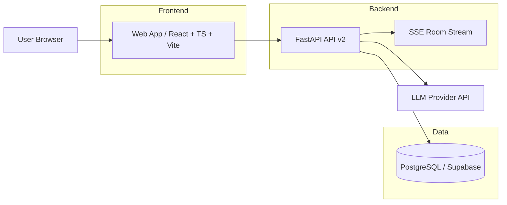
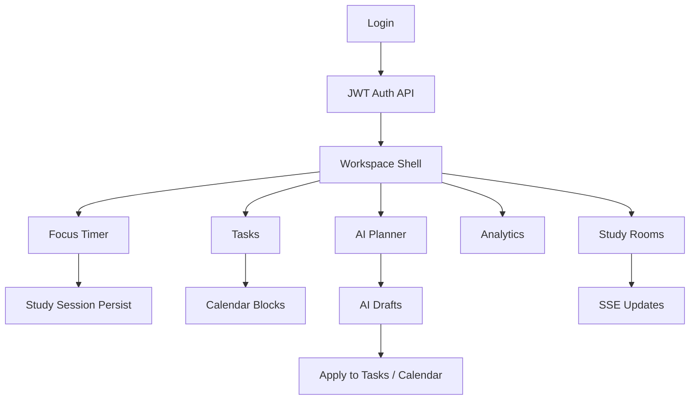
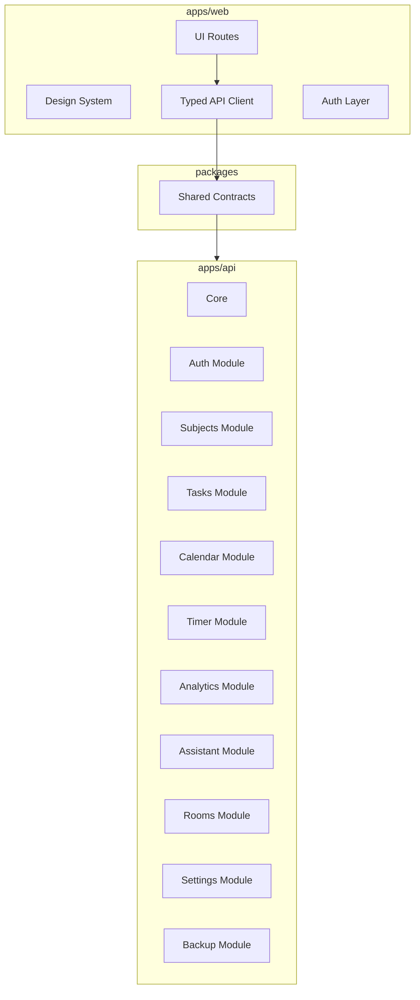

# POTATO-TODO v2 Engineering Master File

## 1. Document Purpose

`agent_v2.md` is the primary implementation record for the v2 refactor. It exists to make the project:

- decision-complete for future implementers
- traceable at the module level
- maintainable after handoff
- aligned with enterprise development and release standards

From this point on, every completed module or major technical milestone must be logged here.

---

## 2. Refactor Goals

The v2 refactor converts POTATO-TODO from a single-process, template-driven app into a fully engineered product platform with:

- frontend/backend separation
- modular-monolith backend architecture
- versioned APIs
- JWT-based auth for web clients
- a premium RePay-led UI system
- lower idle CPU / RAM / power usage
- zero-cost or ultra-low-cost deployment compatibility

Non-negotiable principles:

- high cohesion, low coupling
- typed contracts
- route-level code splitting on the frontend
- module-bound service/repository separation on the backend
- documentation-driven implementation
- testable contracts before rollout

---

## 3. Legacy vs v2 Architecture

| Area | Legacy | v2 Target |
|---|---|---|
| Frontend | FastAPI + Jinja templates + one large JS file | React + TypeScript + Vite SPA |
| Backend | Single FastAPI app with route-heavy main file | Modular FastAPI backend with `core + modules` |
| Auth | Session cookie + server-rendered pages | JWT access token + refresh flow |
| API | Mixed HTML + JSON, unversioned app API | JSON-first versioned `/api/v2/*` |
| State flow | Page-level imperative fetches | Typed client + query layer + route boundaries |
| Performance | Long-running canvas + blur-heavy UI | Static-rich surfaces + low-idle runtime |
| Docs | README + ad hoc notes | `agent_v2.md` as master implementation file |

---

## 4. System Architecture

### 4.1 High-Level System



### 4.2 Core Product Flow



### 4.3 Module Boundary Diagram



---

## 5. Target Repository Layout

```text
potato_todo/
├── apps/
│   ├── api/
│   │   ├── potato_api/
│   │   │   ├── core/
│   │   │   ├── modules/
│   │   │   ├── app.py
│   │   │   └── legacy_bridge.py
│   │   ├── tests/
│   │   └── requirements.txt
│   └── web/
│       ├── src/
│       │   ├── app/
│       │   ├── routes/
│       │   ├── features/
│       │   ├── shared/
│       │   └── styles/
│       ├── public/
│       └── package.json
├── packages/
│   └── contracts/
├── docs/
├── migrations/
├── scripts/
├── tests/                  # legacy compatibility tests during migration
├── agent.md                # legacy handoff snapshot
└── agent_v2.md             # active implementation master file
```

---

## 6. Frontend Technology and Design System Rules

### 6.1 Stack

- React
- TypeScript
- Vite
- TanStack Router
- TanStack Query
- React Hook Form
- Zod
- Radix UI primitives
- Tailwind CSS + CSS variables
- `visx` for charts

### 6.2 Visual Direction

Primary inspiration:

- RePay: composition, surfaces, gradient-led polish
- Apple Mac: spacing discipline, information hierarchy, restrained storytelling
- Muzli: card logic and content framing where useful

Current visual calibration:

- cool white and silver-gray page base instead of warm beige
- cobalt to sky-blue accents for hero emphasis and active states
- large Apple-like route headlines paired with RePay-style gradient moments
- curated card mosaics and content framing inspired by Muzli where discovery or grouping matters

Reference-source-derived token notes:

- Apple global header uses translucent `rgba(250, 250, 252, 0.8)` surfaces with `blur(20px)` and restrained grayscale text
- RePay relies on `Inter Tight`-style sans typography, black/white foundations, and a violet-to-cyan accent path close to `#796dff -> #0099ff`
- Muzli combines editorial serif emphasis with clean sans body typography and very open hero spacing

### 6.3 Performance Rules

Must not exist in authenticated v2 screens:

- permanent full-screen canvas loops
- multiple infinite motion systems running at the same time
- heavy, layered `backdrop-filter` usage as a default surface style
- 1s backend timer polling

Preferred techniques:

- static gradients
- low-cost depth layers
- SVG ornaments
- transform/opacity transitions
- route-level lazy loading
- local timer progression with backend reconciliation

### 6.4 Accessibility Rules

- `prefers-reduced-motion` supported globally
- focus-visible styles required
- color contrast checked for primary content
- dialogs and command surfaces keyboard accessible

---

## 7. Backend Module Boundaries

### 7.1 Core

Responsible for:

- config
- security
- DB/session dependencies
- error model
- logging
- CORS/auth dependencies
- API router assembly

### 7.2 Domain Modules

| Module | Responsibility |
|---|---|
| auth | registration, login, refresh, logout, current user |
| subjects | subject CRUD and goals |
| tasks | task CRUD, overdue state transition |
| calendar | event CRUD and range loading |
| timer | count-up, countdown, pomodoro, session persistence |
| analytics | statistics, summaries, report endpoints |
| assistant | plan/analyze/chat/drafts/quote |
| rooms | room CRUD, membership, ranking snapshot, SSE |
| settings | LLM settings, pomodoro defaults, user preferences |
| backup | export/import/clear data |

### 7.3 Internal Layer Contract

Each module owns:

- `router.py`
- `schemas.py`
- `service.py`
- `repository.py`
- `domain.py`

Rules:

- routers do not embed business rules
- repositories do not orchestrate workflows
- services compose workflows
- domain contains state semantics and rule helpers
- cross-module calls go through service boundaries

---

## 8. API v2 Rules

### 8.1 Base Rules

- all v2 endpoints live under `/api/v2`
- JSON-first
- no business HTML responses
- typed request/response DTOs
- unified error shape

### 8.2 Auth Endpoints

Required:

- `POST /api/v2/auth/register`
- `POST /api/v2/auth/login`
- `POST /api/v2/auth/refresh`
- `POST /api/v2/auth/logout`
- `GET /api/v2/auth/me`

### 8.3 Response Principles

- stable top-level resource shape
- explicit field names
- clear ownership filtering
- no hidden coupling to template rendering

### 8.4 Migration Rule

- v1 stays available during cutover
- v2 is the only contract consumed by the new frontend

---

## 9. Authentication Strategy

Chosen model:

- JWT access token
- refresh token flow
- production-oriented toward HttpOnly secure cookies for refresh
- frontend stores access token in memory

Security rules:

- short access token lifetime
- isolated refresh endpoint
- logout clears refresh state
- current-user endpoint required for app boot

---

## 10. Deployment Topology and Cost Strategy

Default low-cost topology:

- frontend: Cloudflare Pages Free
- backend: Render Free Web Service
- database: Supabase Free Postgres

Constraints accepted:

- backend cold starts are acceptable at zero cost
- rooms remain single-instance SSE for now
- infra complexity stays intentionally low

---

## 11. Milestones

| Milestone | Goal | Status |
|---|---|---|
| M0 | `agent_v2.md` baseline, diagrams, workspace rules | Complete |
| M1 | monorepo scaffold (`apps/web`, `apps/api`, `packages/contracts`) | Complete |
| M2 | backend core + JWT auth + `/api/v2` shell | Complete |
| M3 | frontend app shell + auth shell + design tokens | Complete |
| M4 | core flows: subjects/tasks/calendar/timer/workspace | Complete |
| M5 | advanced flows: analytics/assistant/rooms/settings/backup | In progress |
| M6 | cutover, regression, deploy prep | Pending |

---

## 12. Feature Log Template

Use the following structure every time a module or standalone feature is completed:

### Feature Log Entry

- Feature name:
- Phase:
- Purpose:
- User value:
- APIs:
- Request/response summary:
- Frameworks/libraries used:
- Implementation notes:
- State transitions and edge cases:
- Performance strategy:
- Test coverage:
- Maintenance notes:
- Future extension points:
- Known limitations / technical debt:

---

## 13. Testing and Release Standards

Required before cutover:

- auth flow tests
- user-isolation tests
- timer/session behavior tests
- overdue task behavior tests
- assistant/draft tests
- room isolation and SSE tests
- frontend route and auth-shell tests
- reduced-motion behavior checks
- low-idle runtime validation on authenticated screens

Release standard:

- no authenticated always-on heavy animation loops
- no frontend dependency on legacy Jinja UI
- stable v2 contracts
- `agent_v2.md` synchronized with implemented state

---

## 14. Risks and Technical Debt Register

### Active migration risks

1. Legacy backend logic currently lives in the root `app/` package and must be bridged safely during migration.
2. Existing tests target legacy routes and server-rendered flows.
3. Render free hosting introduces cold-start latency.
4. Rooms are still bound to single-instance SSE semantics.
5. The original frontend contains performance-heavy visual logic that must not leak into v2.

### Migration defaults

- keep legacy app available while v2 is being built
- prefer wrapper/bridge migration over risky one-step deletion
- document each bridge as temporary technical debt

---

## 15. Implementation Log

### Entry 001

- Feature name: v2 implementation master document
- Phase: M0
- Purpose: establish the system architecture, module rules, migration boundaries, and documentation protocol before code refactor
- User value: ensures the refactor is maintainable, reviewable, and handoff-safe
- APIs: none
- Request/response summary: none
- Frameworks/libraries used: Mermaid for architecture diagrams, Markdown for implementation governance
- Implementation notes: this file defines the source-of-truth structure for all upcoming frontend/backend work
- State transitions and edge cases: not applicable
- Performance strategy: architecture decisions explicitly prohibit legacy-style always-on visual loops in authenticated surfaces
- Test coverage: not applicable
- Maintenance notes: every completed module must append a structured entry here
- Future extension points: can later include rollout notes, incident references, and change history summaries
- Known limitations / technical debt: initial document reflects the intended target state before all modules are migrated

### Entry 002

- Feature name: v2 backend core and JWT auth shell
- Phase: M2
- Purpose: establish the new API runtime, security model, and frontend-ready authentication flow for the separated web app
- User value: enables the new frontend to register, log in, refresh session state, log out, and bootstrap current-user context without legacy templates
- APIs: `POST /api/v2/auth/register`, `POST /api/v2/auth/login`, `POST /api/v2/auth/refresh`, `POST /api/v2/auth/logout`, `GET /api/v2/auth/me`, `GET /api/v2/health`
- Request/response summary: JSON-first auth payloads, bearer access token responses, refresh token managed through secure cookie mechanics
- Frameworks/libraries used: FastAPI, SQLAlchemy session reuse from legacy data layer, PyJWT, Pydantic
- Implementation notes: created `apps/api/potato_api` with `core` runtime modules, JWT helpers, request dependencies, and a legacy bridge that reuses proven user/account logic during migration
- State transitions and edge cases: register validates password confirmation, login rejects invalid credentials, refresh requires a valid refresh cookie, current-user rejects inactive or missing users
- Performance strategy: auth endpoints are stateless at request time except for DB-backed user lookup; no template/session middleware dependency is carried into v2
- Test coverage: dedicated v2 auth test covers register, me, refresh, and logout flow
- Maintenance notes: all future v2 modules must use the same `core + module` layering and route registration pattern introduced here
- Future extension points: token rotation store, refresh-token revocation ledger, auth audit logging, stricter CORS policy by environment
- Known limitations / technical debt: the v2 core currently bridges to the legacy root `app` package for data models and business primitives while migration is in progress

### Entry 003

- Feature name: v2 web app shell, route system, and auth runtime
- Phase: M3
- Purpose: replace the default Vite scaffold with a production-oriented frontend shell that can bootstrap JWT auth, lazy-load routes, and host the new design system
- User value: users now enter a dedicated SPA instead of the legacy template UI, and sessions restore from the refresh cookie without reloading server-rendered pages
- APIs: `POST /api/v2/auth/login`, `POST /api/v2/auth/register`, `POST /api/v2/auth/refresh`, `POST /api/v2/auth/logout`, `GET /api/v2/auth/me`
- Request/response summary: auth screens submit JSON payloads, the access token remains in memory, and refresh recovery happens automatically through the HttpOnly cookie channel
- Frameworks/libraries used: React 18, TypeScript, Vite, TanStack Router, TanStack Query, React Hook Form, Zod, Tailwind CSS v4, Radix Dialog
- Implementation notes: added a design-token-driven global stylesheet, route-level lazy loading, app shell navigation, a typed fetch client with refresh retry, and a dedicated auth provider that configures API auth globally
- State transitions and edge cases: bootstrapping begins in `bootstrapping`, transitions to `authenticated` after refresh + profile recovery, and falls back to `unauthenticated` if refresh fails or the access token cannot be renewed
- Performance strategy: authenticated surfaces render static gradients and restrained surface blur instead of permanent canvas or background animation loops; route chunks load on demand
- Test coverage: frontend shell validated through `pnpm --filter @potato/web lint`, `typecheck`, and `build`
- Maintenance notes: new routes should plug into `apps/web/src/app/router.tsx`, use `apiRequest`, and keep access-token handling inside the auth provider instead of re-implementing client auth logic
- Future extension points: route-specific loaders, toast system, persisted navigation preferences, and richer design-system primitives
- Known limitations / technical debt: browser-level E2E coverage is not yet installed, so validation is currently build- and contract-focused

### Entry 004

- Feature name: workspace core flows for subjects, tasks, calendar, and weekly overview
- Phase: M4
- Purpose: establish the new productivity command center that consolidates subject management, task capture, calendar blocks, and weekly stats in one typed route
- User value: users can now create subjects, capture tasks, schedule work blocks, and review lightweight weekly signals from a single workspace view
- APIs: `GET/POST/PATCH/DELETE /api/v2/subjects`, `GET/POST/PATCH/DELETE /api/v2/tasks`, `GET/POST/PATCH/DELETE /api/v2/calendar/events`, `GET /api/v2/analytics/stats`
- Request/response summary: all resources use `items` or `item` envelopes, mutations invalidate the workspace overview query, and analytics stats provide total minutes, streak, breakdown, and daily trend
- Frameworks/libraries used: TanStack Query, shared contracts package, typed workspace feature API module
- Implementation notes: created `features/workspace/api.ts`, aggregated workspace loading through a single `workspaceOverview` fetch path, and split inline forms from list rendering to keep data flow predictable
- State transitions and edge cases: subject deletion surfaces backend guardrails for recorded study sessions, task state changes preserve backend overdue logic, and event creation enforces start/end validation through the API
- Performance strategy: overview data loads once per range, list mutations invalidate targeted queries instead of brute-force reloads, and no background polling is introduced
- Test coverage: validated via web lint, typecheck, and production build against the typed contracts consumed by the page
- Maintenance notes: any new workspace card should extend `workspaceOverview` or introduce a separate query with a clearly scoped key rather than embedding ad hoc fetches inside child components
- Future extension points: inline event editing, due-date filters, drag-based schedule moves, and richer subject goal editing
- Known limitations / technical debt: task and calendar editing are currently lightweight and mutation-driven; no optimistic update layer is installed yet

### Entry 005

- Feature name: low-idle focus runtime with local timer progression
- Phase: M4
- Purpose: replace the legacy high-polling focus behavior with a client-driven timer surface that keeps the CPU profile low while preserving backend truth
- User value: users can run count-up, count-down, and pomodoro sessions for long periods without the old 1-second API polling pattern
- APIs: `GET /api/v2/timer/current`, `POST /api/v2/timer/start`, `POST /api/v2/timer/pause`, `POST /api/v2/timer/resume`, `POST /api/v2/timer/stop`, `POST /api/v2/timer/pomodoro/start`, `POST /api/v2/timer/pomodoro/skip`, `GET /api/v2/settings/pomodoro`
- Request/response summary: the backend returns a `result` envelope containing timer metadata, elapsed seconds, remaining seconds, pomodoro phase, and session completion markers
- Frameworks/libraries used: TanStack Query, shared contracts, custom low-idle timer projection logic
- Implementation notes: the page projects elapsed and remaining time locally from the last synchronized timer payload, pauses tick work when the tab is hidden, and periodically reconciles via `/current`
- State transitions and edge cases: start requires a subject, pomodoro presets fall back to settings defaults, zero-second countdown boundaries trigger immediate server reconciliation, and stop invalidates workspace/analytics surfaces after session persistence
- Performance strategy: no 1-second backend polling; local ticking only happens while the page is visible and the timer is active, with a 15-second sync interval plus visibility recovery
- Test coverage: validated through frontend lint, typecheck, build, and backend v2 test suite coverage for auth plus stream auth compatibility
- Maintenance notes: timer behavior changes should stay centralized in `routes/focus-page.tsx` and `features/focus/api.ts` until a dedicated `features/focus` view-model layer is extracted
- Future extension points: manual focus adjustment UI, schedule-event linking from the workspace, desktop notifications, and reduced-motion-specific timer themes
- Known limitations / technical debt: there is not yet a dedicated automated frontend test that simulates a long-running focus session over visibility changes

### Entry 006

- Feature name: analytics and planner advanced productivity surfaces
- Phase: M5
- Purpose: expose demand-loaded analytics and artifact-first AI planning without leaking chart or AI complexity into the main workspace surfaces
- User value: users can inspect focus trends only when needed, generate plan or analysis drafts, review JSON payloads, and maintain scoped assistant conversations
- APIs: `GET /api/v2/analytics/stats`, `POST /api/v2/assistant/plan`, `POST /api/v2/assistant/analyze`, `GET /api/v2/assistant/drafts`, `POST /api/v2/assistant/drafts/{id}/apply`, `GET /api/v2/assistant/chat/sessions`, `GET /api/v2/assistant/chat/sessions/{id}`, `DELETE /api/v2/assistant/chat/sessions/{id}`, `POST /api/v2/assistant/chat/send`, `GET /api/v2/assistant/daily-quote`
- Request/response summary: analytics returns `stats`, planner mutations return `item` draft payloads, chat send returns the updated conversation and session list, and daily quote returns a lightweight quote payload
- Frameworks/libraries used: `@visx/xychart`, TanStack Query, shared contracts, typed planner feature API module
- Implementation notes: analytics is isolated to a lazy route chunk so heavy chart code is never loaded into the rest of the app; planner requests always land as drafts first, then require explicit apply
- State transitions and edge cases: empty analytics windows render non-blocking empty states, planner actions refresh draft/session caches, and conversation selection gracefully falls back to the first available session
- Performance strategy: analytics code stays route-split, charts are never mounted outside the analytics route, and planner chat uses request/response interactions instead of persistent streaming
- Test coverage: frontend lint, typecheck, and production build cover the typed planner and analytics integrations
- Maintenance notes: keep AI mutations draft-first; do not bypass the apply step for direct task/calendar writes unless the product explicitly changes that review model
- Future extension points: richer chart filters, draft diff previews, assistant tool-call traces, and conversation search
- Known limitations / technical debt: analytics currently ships a large dedicated chunk because `visx` is loaded with the route; additional chart trimming can happen later if needed

### Entry 007

- Feature name: rooms collaboration surface and SSE auth bridge
- Phase: M5
- Purpose: enable the new frontend to use single-room SSE updates without browser-unfriendly auth hacks, while preserving low-cost deployment compatibility
- User value: users can create rooms, join by code, inspect rankings, and receive lightweight room updates in real time from the new SPA
- APIs: `GET /api/v2/rooms`, `POST /api/v2/rooms`, `POST /api/v2/rooms/join`, `GET /api/v2/rooms/{id}`, `GET /api/v2/rooms/{id}/snapshot`, `GET /api/v2/rooms/{id}/stream`, `POST /api/v2/rooms/{id}/leave`, `POST /api/v2/rooms/{id}/reset-code`, `POST /api/v2/rooms/{id}/close`, `POST /api/v2/rooms/{id}/members/{member_user_id}/kick`
- Request/response summary: lobby endpoints return `items`, detail and snapshot return `item`, and the stream endpoint emits `room_update` plus periodic `ping` events
- Frameworks/libraries used: FastAPI SSE streaming, TanStack Query, browser `EventSource`, shared room contracts
- Implementation notes: introduced `get_current_user_for_stream` so the stream endpoint can accept either a bearer header or `access_token` query parameter, which the browser `EventSource` client can actually send
- State transitions and edge cases: the active room stream tears down on room switch, owner-only actions stay on the detail surface, and lobby selection falls back to the first room if no explicit selection exists
- Performance strategy: only one room stream stays open at a time, and incoming events invalidate targeted room queries instead of triggering broad polling or page reloads
- Test coverage: added backend test `apps/api/tests/test_v2_rooms_stream.py` to validate the query-token auth path; frontend integration validated via lint, typecheck, and build
- Maintenance notes: future realtime additions should reuse the same targeted invalidation strategy and avoid adding cross-page ambient polling
- Future extension points: presence counters, room-level activity feed, optional reconnection backoff, and multi-instance pub/sub if deployment requirements outgrow single-instance SSE
- Known limitations / technical debt: the rooms runtime still assumes a single application instance for authoritative in-memory SSE fan-out

### Entry 008

- Feature name: settings and backup control plane
- Phase: M5
- Purpose: centralize user-level runtime configuration and data maintenance actions in a dedicated operational route
- User value: users can configure LLM defaults, save pomodoro presets, export a backup JSON, import workspace state, and explicitly clear data with confirmation
- APIs: `GET/POST /api/v2/settings/llm`, `GET/POST /api/v2/settings/pomodoro`, `GET /api/v2/backup/export`, `POST /api/v2/backup/import`, `POST /api/v2/backup/clear`
- Request/response summary: settings endpoints return `settings`, export returns a JSON file attachment, import returns a simple action result, and clear requires a confirmation payload
- Frameworks/libraries used: TanStack Query, typed settings feature API module, Radix Dialog for destructive confirmation
- Implementation notes: the route now separates LLM preferences, pomodoro defaults, and recovery actions, while the backup export helper converts the API response into a browser download
- State transitions and edge cases: settings forms use local drafts layered over remote values, import blocks until a file is chosen, and clear stays behind an explicit modal confirmation
- Performance strategy: this route is fully user-triggered and introduces no background activity beyond on-demand queries and mutations
- Test coverage: frontend lint, typecheck, build, plus backend v2 tests that cover auth and stream-auth compatibility for the shared runtime
- Maintenance notes: destructive data operations must remain isolated from the main workspace surfaces and continue to require explicit confirmation
- Future extension points: environment presets, multi-export formats, encrypted backups, and admin-only site configuration views
- Known limitations / technical debt: backup flows are validated contractually and through build/test runs, but browser-level import/export UX is not yet covered by automated E2E tests

### Entry 009

- Feature name: auth screen stabilization and visual realignment
- Phase: M3
- Purpose: resolve the broken login/register experience and realign the entry page's visual language with the RePay / Muzli / Apple reference direction
- User value: users can now create accounts and sign in without client-side schema failures, while the first screen feels calmer, lighter, and more aligned with the requested premium reference set
- APIs: `POST /api/v2/auth/login`, `POST /api/v2/auth/register`
- Request/response summary: form data remains JSON-first, but the client now submits through two independent typed form flows instead of a shared union-based handler
- Frameworks/libraries used: React Hook Form, Zod, forwardRef-based form primitives
- Implementation notes: fixed form-field registration by forwarding refs from shared `Input`, `Textarea`, and `Select`, then split login and register into separate form controllers to remove `undefined`-driven schema ambiguity
- State transitions and edge cases: each form now owns its own root error state, register keeps `confirm_password` as a hard-required field, and login no longer shares hidden-field state with register
- Performance strategy: purely local UI fix; no new runtime polling, animation loops, or extra data loading were introduced
- Test coverage: verified through `pnpm --filter @potato/web typecheck`, `lint`, and `build`
- Maintenance notes: any future auth-surface redesign should preserve ref-forwarding on shared field primitives and avoid unionizing dissimilar forms into one hook
- Future extension points: password reset, magic-link entry, remember-last-mode UX, and brand-level auth illustrations
- Known limitations / technical debt: the rest of the authenticated application still uses the current token set; broader product-wide color harmonization can continue route by route

### Entry 010

- Feature name: v2 visual system reset and route-level premium UI realignment
- Phase: M3-M5
- Purpose: move the authenticated product shell and key routes away from the legacy left-rail / warm-dashboard look into a cooler, cleaner, reference-aligned visual system that better matches the requested RePay, Apple Mac, and Muzli direction
- User value: users now see a materially different product identity with larger editorial headlines, lighter premium surfaces, stronger composition, and less resemblance to the old v1 experience
- APIs: no contract changes; existing `/api/v2/*` frontend integrations remain intact
- Request/response summary: unchanged from prior v2 route implementations; this iteration is a presentation-system and UX-structure refactor rather than an API change
- Frameworks/libraries used: React, Tailwind CSS v4, existing route and query runtime, Google-hosted `Instrument Sans` and `Instrument Serif` for the new editorial hierarchy
- Implementation notes: replaced the sidebar-heavy app shell with a top navigation capsule, shifted global tokens to a white/silver/blue palette, rebuilt the auth hero, and restyled Workspace, Focus, Planner, Analytics, Rooms, and Settings around bigger headlines, softer cards, and calmer visual pacing
- State transitions and edge cases: authentication, timer projection, planner drafts, room streaming, and settings mutations all preserve prior state behavior; only user-facing structure, labels, and styling were changed
- Performance strategy: the redesign avoids bringing back heavy canvas systems or perpetual motion; visual emphasis comes from static gradients, lighter shadows, and short transitions rather than constant animation loops
- Test coverage: passed `corepack pnpm --filter @potato/web lint`, `corepack pnpm --filter @potato/web typecheck`, `corepack pnpm --filter @potato/web build`, and root `corepack pnpm test`; local preview verified on `http://localhost:5174`
- Maintenance notes: future UI work should keep the cool neutral base, restrained accent gradients, and top-level navigation structure; avoid reintroducing exposed framework/architecture copy into visible product surfaces
- Future extension points: deeper card mosaics on Workspace, richer art direction for empty states, localized content tone variants, and optional higher-fidelity marketing-style illustrations on auth surfaces
- Known limitations / technical debt: Workspace still carries some dense form structures from the first v2 pass and can be editorially refined further; local preview currently runs on `5174` because an existing process was already occupying `5173`

### Entry 011

- Feature name: reference-source-driven visual calibration pass
- Phase: M3-M5
- Purpose: reduce the remaining gap between the current v2 frontend and the requested RePay / Apple / Muzli references by inspecting their live frontend resources and aligning the project to concrete source-derived visual rules
- User value: the product now looks materially closer to the target references in color logic, typography stack, blur treatment, gradient behavior, and hero composition instead of only carrying a generic light-theme redesign
- APIs: unchanged; all existing `/api/v2/*` integrations remain the same
- Request/response summary: no contract changes in this pass; the work is presentation-only
- Frameworks/libraries used: existing React/Tailwind runtime, plus source-aligned web typography choices (`Inter Tight`/`Poppins`/serif emphasis) and updated global CSS tokens
- Implementation notes: inspected Apple global header styles, RePay Framer token output, and Muzli stylesheet/font choices; then updated global tokens to an Apple-like `#fbfbfd` base, introduced RePay-style `#796dff -> #0099ff` gradients, tightened navigation into a translucent blur capsule, and rebuilt auth/workspace/focus hero sections around larger editorial composition
- State transitions and edge cases: authentication, timers, drafts, rooms, and settings behavior remain unchanged; only their presentation layers were reauthored
- Performance strategy: keeps the low-idle standard intact by using static gradients, glass surfaces, and hover elevation rather than long-running canvas or perpetual motion effects
- Test coverage: passed `corepack pnpm --filter @potato/web lint`, `corepack pnpm --filter @potato/web typecheck`, and `corepack pnpm --filter @potato/web build`; visual verification performed locally on `http://localhost:5174`
- Maintenance notes: future UI changes should continue to respect the inspected source patterns instead of drifting back toward warm beige dashboard styling; direct third-party code copying should still be avoided in favor of source-informed reimplementation
- Future extension points: apply the same source-derived calibration to deeper list states, richer planner cards, and marketing-quality empty states; optionally introduce route-specific accent palettes while staying within the same token family
- Known limitations / technical debt: some functional forms still expose a denser productivity layout than the references, especially in lower sections of Workspace; further restructuring can continue without changing backend contracts

### Entry 012

- Feature name: high-fidelity compositional redesign for auth and major v2 route openings
- Phase: M3-M5
- Purpose: move the v2 experience from a mostly restyled productivity dashboard into a more reference-faithful editorial product surface by changing composition, contrast, typography hierarchy, and route-opening choreography
- User value: the product now opens with larger brand-grade hero sections, deeper light/dark contrast, cleaner surface rhythm, and a more premium first impression across Auth, Workspace, Planner, Analytics, and Rooms
- APIs: unchanged; all existing `/api/v2/*` integrations remain intact
- Request/response summary: no API contract changes in this pass; data loading and mutations remain identical while layout and presentation structure were re-authored
- Frameworks/libraries used: existing React + Tailwind runtime, shared UI primitives, source-informed typography stack (`Inter Tight`, `Poppins`, serif emphasis), and existing TanStack route/query architecture
- Implementation notes: reworked global visual tokens toward cooler Apple-like neutrals, strengthened RePay-like violet/cyan emphasis, introduced reusable dark showcase surfaces, upgraded navigation glass treatment, removed visible meta-design copy from product pages, and rebuilt route openings around split headlines, asymmetrical card mosaics, and editorial content blocks instead of plain metric rows
- State transitions and edge cases: login/register behavior, workspace CRUD flows, planner drafts, analytics fetches, and room streaming state all preserve prior runtime behavior; only the route shell composition and visible content framing changed
- Performance strategy: the new fidelity comes from static gradients, shadow layering, blur capsules, and contrast panels rather than restoring long-running animation systems; reduced-motion handling remains enforced globally
- Test coverage: passed `corepack pnpm --filter @potato/web lint`, `corepack pnpm --filter @potato/web typecheck`, and `corepack pnpm --filter @potato/web build`
- Maintenance notes: future page work should preserve the current visual grammar of light page fields plus selective deep showcase panels, keep visible copy product-focused rather than implementation-focused, and avoid drifting back toward dense admin-dashboard layout patterns
- Future extension points: continue this compositional language into Settings and lower Workspace operation zones, add route-specific art assets or SVG motifs, and create explicit themed variants for empty states and onboarding
- Known limitations / technical debt: lower-half CRUD forms on Workspace and some operation-heavy panels still carry utility-first density because backend behavior was intentionally preserved during this pass; additional presentational extraction can happen later without touching API contracts

### Entry 013

- Feature name: RePay-led sequential scroll layout pass
- Phase: M3-M5
- Purpose: address the remaining mismatch against the RePay reference by shifting the v2 frontend away from card-heavy dashboard composition into a lighter, sequential, brand-page-style scroll structure
- User value: the product now opens with a much whiter base canvas, lighter navigation, `Inter Tight`-led typography, integrated section backgrounds, and scroll-triggered reveal behavior instead of parallel boxed modules
- APIs: unchanged; all existing `/api/v2/*` contracts remain intact
- Request/response summary: no API contract changes in this pass; only presentation, layout sequencing, and front-end interaction choreography were reworked
- Frameworks/libraries used: existing React + Tailwind runtime, a new shared `ScrollReveal` component using `IntersectionObserver`, shared UI primitives, and the current router/query stack
- Implementation notes: replaced the previous Apple/Muzli blend with a RePay-dominant design language, switched global typography to `Inter Tight`, simplified the top navigation, flattened borders and glass panels, rebuilt Auth into a centered hero + embedded form stage, and rewrote Workspace as a sequential long-scroll page with hero stage, stat band, sticky visual storytelling, and ordered task/subject/calendar sections
- State transitions and edge cases: authentication, task CRUD, subject CRUD, calendar CRUD, and weekly stats behavior are unchanged; reveal animation only enhances presentation and safely degrades under `prefers-reduced-motion`
- Performance strategy: scroll effects are one-time `IntersectionObserver` reveals plus sticky positioning; there are no canvas loops, no perpetual background animations, and no new polling behavior introduced
- Test coverage: passed `corepack pnpm --filter @potato/web lint`, `corepack pnpm --filter @potato/web typecheck`, and `corepack pnpm --filter @potato/web build`
- Maintenance notes: future UI work should keep the long-page flow, avoid reintroducing thick card borders and pill-heavy navigation, and preserve the rule that high-level narrative sections come before dense operational forms
- Future extension points: carry the same sequential scroll system into Focus, Planner, Analytics, Rooms, and Settings; add section-specific illustration backgrounds; optionally introduce route-aware active nav markers closer to the reference behavior
- Known limitations / technical debt: deeper product routes still retain some legacy v2 panel arrangements even though the shared design system has been pulled toward the new RePay language; those routes should be rewritten route-by-route instead of patched with more card styling

### Entry 014

- Feature name: typography and motion refinement pass
- Phase: M3-M5
- Purpose: improve the remaining roughness in type rhythm and visual motion by making headings lighter, reveal transitions richer, and non-home routes participate in the same page choreography
- User value: text now reads with a more premium pace, long titles feel less heavy, and each major route has visible entrance motion instead of only the workspace carrying the new visual behavior
- APIs: unchanged; no backend or contract changes were required for this pass
- Request/response summary: no data shape changes; all improvements are presentation-only
- Frameworks/libraries used: existing React runtime, shared `ScrollReveal` component, `IntersectionObserver`, current Tailwind/CSS token system
- Implementation notes: reduced heading weight, added balance-friendly heading behavior, introduced blur + scale + translate reveal transitions, added a softer reveal mode for support sections, and wrapped Focus, Planner, Analytics, Rooms, and Settings route sections in the shared reveal choreography
- State transitions and edge cases: route content still renders normally when JavaScript is active; under reduced-motion preferences the reveal system resolves to static immediate rendering
- Performance strategy: reveal effects stay one-shot and observer-driven, so there is still no background animation loop or persistent motion system
- Test coverage: passed `corepack pnpm --filter @potato/web lint`, `corepack pnpm --filter @potato/web typecheck`, and `corepack pnpm --filter @potato/web build`
- Maintenance notes: future animation additions should continue to use the shared reveal primitives instead of ad hoc per-page animation code; typography changes should prefer token-level adjustments over route-local font overrides
- Future extension points: add alternating left/right reveal directions, route-specific motion variants, and optional sticky-step storytelling on more pages
- Known limitations / technical debt: this pass materially improves motion consistency, but some deeper route layouts still inherit earlier structure and would benefit from a second route-by-route compositional cleanup if pixel-level fidelity remains the goal

### Entry 015

- Feature name: workspace hero presentation repair and spacing correction
- Phase: M3-M5
- Purpose: fix the remaining homepage presentation issues surfaced by visual review, especially the weak first-line headline presence, over-tight letter spacing, and dark-stage overlays obscuring important content
- User value: the workspace hero now reads more clearly, the title feels less cramped, and the right-side showcase panel no longer hides primary information behind floating cards
- APIs: unchanged; no data contract or backend behavior changed
- Request/response summary: no request/response changes; this was a layout and typography repair pass
- Frameworks/libraries used: existing React/Tailwind runtime, shared CSS token system, current workspace route implementation
- Implementation notes: split the homepage hero into a smaller black lead line plus a larger gradient anchor line, relaxed global negative tracking for hero/section/metric typography, and rebalanced the dark showcase panel with reserved padding so floating cards no longer overlap the main weekly-focus content
- State transitions and edge cases: all workspace task/subject/calendar mutations behave exactly as before; only the hero presentation and local layout geometry changed
- Performance strategy: no new animation loops or background work were introduced; this is purely a static layout correction on top of the current reveal system
- Test coverage: passed `corepack pnpm --filter @potato/web lint`, `corepack pnpm --filter @potato/web typecheck`, and `corepack pnpm --filter @potato/web build`
- Maintenance notes: future hero revisions should preserve explicit hierarchy between lead line and accent line, and floating decorative cards must continue to reserve space rather than cover active content
- Future extension points: apply the same relaxed tracking and two-step title hierarchy to other route heroes if visual density remains too high
- Known limitations / technical debt: some route-local headings outside the workspace still use route-authored tracking values and may need a second cleanup pass for total typography consistency

### Entry 016

- Feature name: workspace typography system upgrade and homepage composition refinement
- Phase: M3-M5
- Purpose: further close the visual gap between the current v2 homepage and the RePay reference by improving font fidelity, loosening headline tracking, reducing boxed density, and making the homepage flow read more like a premium product narrative
- User value: the homepage now feels lighter and more elegant, headline spacing has more breathing room, the nav is cleaner, and the first long-scroll showcase reads as a sequence instead of a pile of separate cards
- APIs: unchanged; all existing `/api/v2/*` integrations continue to work without contract changes
- Request/response summary: no payload or DTO changes in this pass; the work is presentation-only
- Frameworks/libraries used: existing React + Tailwind runtime, shared UI primitives, source-aligned `Inter` + `Inter Tight` font assets derived from the live RePay frontend resources, and the current `ScrollReveal` system
- Implementation notes: switched the global typography stack to a closer RePay-style split of `Inter` for body copy and `Inter Tight` for display text; recalibrated hero/section/body tracking and line-height tokens; simplified the top app shell; added an inline hero meta strip; replaced the stage’s three parallel mini-cards with a stacked narrative list; and softened homepage section containers so they blend into the background more naturally
- State transitions and edge cases: all task, subject, calendar, analytics, and auth behaviors remain unchanged; only typography, spacing, and local visual composition were adjusted
- Performance strategy: the refinement preserves the low-idle constraint by using static gradients, passive blur surfaces, and one-shot reveal motion only; no polling, canvas loops, or persistent animation systems were added
- Test coverage: passed `corepack pnpm --filter @potato/web lint`, `corepack pnpm --filter @potato/web typecheck`, and `corepack pnpm --filter @potato/web build`
- Maintenance notes: future visual work should continue to change typography at the token/shared-component layer first, keep route heroes on the same spacing rhythm, and avoid reintroducing dense equal-width card grids in the homepage opening sequence
- Future extension points: extend the same RePay-aligned typography cleanup into Focus, Planner, Analytics, Rooms, and Settings; add route-specific stacked narrative sections; and introduce more precise section-by-section motion variants if even stronger reference fidelity is required
- Known limitations / technical debt: this pass materially improves homepage elegance, but deeper route interiors still include some operational forms whose utility density is higher than the reference and may need another presentational extraction pass later

### Entry 017

- Feature name: workspace clipping fix, full-bleed header, smooth wheel scroll, and hero ticker
- Phase: M3-M5
- Purpose: eliminate the remaining first-screen rendering defects on Workspace while pushing the opening interaction closer to the RePay reference through smoother mouse-wheel motion and a branded horizontal ticker directly under the hero headline
- User value: the first showcase screen no longer clips stacked content, purple display letters with descenders render fully, the top navigation now spans the full viewport width, mouse-wheel scrolling feels softer and more premium, and the homepage opening carries a stronger RePay-like motion signature
- APIs: unchanged; no `/api/v2/*` contract or backend behavior changed
- Request/response summary: no request or response changes in this pass; all work is presentational and interaction-layer only
- Frameworks/libraries used: existing React + Tailwind runtime, shared UI/components layer, a new lightweight custom wheel-smoothing runtime, and CSS-based marquee animation
- Implementation notes: fixed the Workspace showcase clipping by removing stage-level overflow clipping and switching the left narrative column from a stretched flex layout to intrinsic grid flow; widened the app header background to full-viewport bleed while keeping content aligned to the shared max-width container; increased hero display line-height/padding to prevent clipped `p/g/y` descenders in gradient text; added a reusable horizontal marquee ticker under the hero copy; and introduced a custom mouse-wheel smoothing component that only animates while wheel input is active
- State transitions and edge cases: all auth, task, subject, calendar, analytics, timer, and rooms behaviors remain unchanged; the wheel smoothing automatically disables under `prefers-reduced-motion`, ignores editable form controls, and avoids hijacking nested scrollable containers
- Performance strategy: the new scrolling layer is intentionally event-driven rather than permanently running a global animation loop, and the marquee uses a single transform animation that is disabled for reduced-motion users
- Test coverage: passed `corepack pnpm --filter @potato/web lint`, `corepack pnpm --filter @potato/web typecheck`, and `corepack pnpm --filter @potato/web build`
- Maintenance notes: future hero or header work should preserve the full-bleed shell structure, keep display text from using over-tight line-height on gradient headings, and reuse the shared smooth-scroll and ticker primitives instead of page-local scripts
- Future extension points: carry the same wheel-smoothing and marquee grammar into other major landing sections, add route-aware ticker vocabularies, and evolve the current custom smoothing layer into a shared motion-control module if more scroll-linked storytelling is introduced later
- Known limitations / technical debt: the current wheel smoothing is optimized for mouse-wheel desktop usage and intentionally conservative around nested scroll areas; if future pages add complex internal scroll regions, the target-filtering rules may need another pass

### Entry 018

- Feature name: RePay-style ticker refinement, glass button system, and cross-route descender-safe typography pass
- Phase: M3-M5
- Purpose: tighten the remaining visual mismatch against the RePay reference by moving the Workspace ticker toward a first-screen footer position, restyling it into grey tile-like chips, upgrading action buttons to a macOS-like glass treatment, softening the Workspace purple stage edge, and eliminating descender clipping on large headings across the rest of the product
- User value: the Workspace opening now feels more premium and more recognizably RePay-inspired, CTA buttons read with a stronger glass identity, the pale-purple stage frame blends more naturally into the page, and display text on other routes no longer cuts off lower letterforms such as `p`, `g`, and `y`
- APIs: unchanged; all `/api/v2/*` integrations continue to behave exactly as before
- Request/response summary: no request or response changes were introduced in this pass; this was a visual-system and interaction-polish refinement only
- Frameworks/libraries used: existing React + Tailwind runtime, shared UI token system, CSS keyframes/masks for ticker motion, and the current custom smooth-scroll helper
- Implementation notes: moved the Workspace marquee into a dedicated hero-footer region so it sits near the bottom of the initial viewport, rebuilt the ticker chips into bolder grey rounded-rectangle tiles, expanded the global button variants into a glassmorphism-style system with blur and translucent layering, widened/softened the Workspace showcase wrapper to reduce the visible top-left lavender edge, and patched route-level editorial headings in Auth, Planner, Analytics, Rooms, and Dialog surfaces so display text uses safer line-height for descenders
- State transitions and edge cases: application state, routing, auth, CRUD flows, and realtime room behavior are unchanged; reduced-motion users still receive a non-animated ticker because the shared motion safeguard disables that animation path
- Performance strategy: the visual upgrade keeps the low-cost rule intact by relying on lightweight CSS styling changes and a single marquee transform rather than new background loops or high-frequency rendering workloads
- Test coverage: passed `corepack pnpm --filter @potato/web lint`, `corepack pnpm --filter @potato/web typecheck`, and `corepack pnpm --filter @potato/web build`
- Maintenance notes: future premium-style button or ticker work should extend the shared token/component layer instead of forking route-local button skins; display headings should avoid hard-coded sub-`1.0` line-heights unless the exact glyph box is visually verified
- Future extension points: add alternate ticker vocabularies per route, create glass-surface intensity variants for destructive vs primary actions, and extract a shared editorial-heading utility if more custom hero panels are added
- Known limitations / technical debt: the current ticker is visually much closer to the RePay reference, but if stricter 1:1 parity is required later the exact chip spacing and motion cadence may still need one more live-reference tuning pass

### Entry 019

- Feature name: workspace hero background hard-edge fix and right-stage preview redesign
- Phase: M3-M5
- Purpose: remove the remaining visually broken artifacts in the Workspace opening by eliminating the cropped lavender hero edge, constraining the ticker-affected hero container, and replacing the bug-like dark right-side stage with a structured light preview surface
- User value: the Workspace first screen now reads as a coherent premium composition instead of showing a cropped purple corner, a misaligned hero, or a confusing dark-side block that looked like a rendering bug
- APIs: unchanged; no `/api/v2/*` contracts or backend behavior changed
- Request/response summary: no request or response changes were introduced in this pass; this is a layout and design-system correction only
- Frameworks/libraries used: existing React + Tailwind runtime, shared CSS token system, current ticker component, and existing shared button primitives
- Implementation notes: replaced the cropped top-left hero pseudo-gradients with in-surface radial backgrounds to remove the hard clipped corner; constrained the Workspace hero intro container to the same max-width rhythm as the rest of the page so enlarged ticker tiles cannot push the headline off-center; upgraded ticker chips to larger deep-black tile typography; strengthened the shared glass button palette into darker primary and clearer translucent secondary treatments; and rewrote the `Today at a glance` right column into a stable light preview panel with explicit metric, lane, window, and current-read sections instead of floating cards over a dark showcase field
- State transitions and edge cases: task, subject, calendar, auth, analytics, and rooms behaviors remain unchanged; only the Workspace hero composition and shared visual tokens were adjusted
- Performance strategy: the redesign keeps the same low-runtime-cost profile because it swaps static backgrounds and lightweight layout structure rather than adding any new persistent animation systems
- Test coverage: passed `corepack pnpm --filter @potato/web lint`, `corepack pnpm --filter @potato/web typecheck`, and `corepack pnpm --filter @potato/web build`
- Maintenance notes: future hero changes should keep large animated or max-content elements inside an explicitly bounded composition wrapper; background glows should be drawn as integrated surface gradients rather than cropped pseudo-elements when visual hard edges are unacceptable
- Future extension points: extract the new Workspace preview card into a reusable hero-preview pattern for Focus, Planner, or Rooms and optionally split ticker vocabulary into semantic groups such as tasks, focus, planning, and rooms
- Known limitations / technical debt: this pass fixes the main Workspace hero artifacts, but if exact RePay parity is still required the remaining differences will mostly be micro-spacing, ticker cadence, and route-specific content choreography rather than broken structure

### Entry 020

- Feature name: full-bleed workspace blend pass, ticker tile parity tuning, and analytics axis cleanup
- Phase: M3-M5
- Purpose: resolve the next round of visual mismatches by turning the Workspace hero into a true full-bleed RePay-style blended field, refining button/ticker treatments, lowering `Today at a glance` information density, and fixing unreadable Analytics date-axis labels
- User value: the Workspace opening now fades across the full viewport instead of reading like a centered purple slab, ticker tiles look closer to the RePay grey-card rhythm, action buttons carry a cleaner macOS-like glass feel, the `Today at a glance` block is easier to parse, and the Analytics chart axis no longer collapses into overlapping dates
- APIs: unchanged; all `/api/v2/*` integrations remain the same
- Request/response summary: no request or response contract changes were introduced in this pass; all work stays in presentation, layout, and front-end readability
- Frameworks/libraries used: existing React + Tailwind runtime, shared CSS token layer, current Workspace route composition, and existing `visx` chart components for Analytics
- Implementation notes: converted the Workspace hero wrapper into a viewport-wide blended canvas with subtle vertical RePay-style guide lines and broader radial color falloff; upgraded the shared glass button system with more translucent depth and clearer dark/light variants; rebuilt ticker chips into larger rectangular grey tiles with stronger typography and subtle corner-detail treatment; simplified the `Today at a glance` right column by removing duplicate lane cards and replacing them with a smaller weekly-focus summary plus two concise narrative rows; loosened shared heading rhythm through token-level line-height and stack spacing updates; and reduced Analytics x-axis crowding by switching the daily line to sparse `Apr/May` labels with angled tick rendering
- State transitions and edge cases: task, subject, calendar, auth, rooms, planner, and timer state behavior are unchanged; the typography changes apply across routes but do not alter data flow; reduced-motion behavior still disables ticker motion through the existing shared guard
- Performance strategy: the full-bleed hero effect is still static CSS only, ticker motion remains one transform animation, and the Analytics axis fix reduces visual clutter without adding any extra rendering loop or data polling
- Test coverage: passed `corepack pnpm --filter @potato/web lint`, `corepack pnpm --filter @potato/web typecheck`, and `corepack pnpm --filter @potato/web build`
- Maintenance notes: future RePay-fidelity tuning should continue to happen in shared token/component layers first; full-bleed hero sections should use viewport-based wrappers rather than oversized internal cards; chart readability fixes should prefer tick selection/formatting over shrinking the canvas into illegibility
- Future extension points: extract the new ticker tile grammar into reusable route-level marquees, add optional viewport-specific hero density variants, and reuse the sparse-axis formatter in any later trend chart with long date windows
- Known limitations / technical debt: this pass materially improves parity for hero blending and analytics readability, but the lower Workspace operational sections still keep some utilitarian CRUD density by design because backend behavior and existing information architecture were preserved during the rebuild

### Entry 021

- Feature name: workspace hero side-fade correction
- Phase: M3-M5
- Purpose: correct the overextended workspace hero background after the previous full-bleed blend pass by removing the visible grey guide lines and restoring a center-heavy lavender glow that fades back to white near the outer sides
- User value: the workspace opening no longer looks like the whole horizontal viewport is filled with purple, and the side areas recover the lighter white-base breathing room the user expected
- APIs: unchanged; no `/api/v2/*` interfaces or backend behavior changed
- Request/response summary: no contract changes; this pass only adjusts the hero background rendering strategy
- Frameworks/libraries used: existing React + Tailwind runtime with shared CSS token/layout system
- Implementation notes: removed the vertical guide-line layer from `.repay-hero-bg`, replaced the previous broad full-field blend with a center-weighted elliptical lavender gradient, and added explicit left/right white fade bands so the outer roughly 20% of the hero visually returns to the white page background
- State transitions and edge cases: no route, auth, task, timer, or analytics state flow changed; only the workspace hero background paint stack was updated
- Performance strategy: still static CSS-only rendering with no added animation or runtime cost
- Test coverage: passed `corepack pnpm --filter @potato/web build`
- Maintenance notes: future workspace hero iterations should preserve the rule that the strongest lavender energy stays in the center while the outer edges return to the white canvas unless the user explicitly asks for a denser full-bleed field
- Future extension points: if needed later, the same center-out fade rule can be turned into a shared hero-background variant token instead of being route-specific
- Known limitations / technical debt: this pass intentionally prioritizes correcting the user's preferred background composition over strict full-bleed RePay mimicry

### Entry 022

- Feature name: workspace hero spread expansion and header-to-hero blend pass
- Phase: M3-M5
- Purpose: widen the workspace lavender field slightly beyond the previous correction and remove the visual seam between the top navigation bar and the hero canvas
- User value: the purple focus area now reaches farther toward both sides without turning into a full-screen color wash, and the top bar reads as part of the same scene instead of a separate white block sitting above it
- APIs: unchanged; no `/api/v2/*` interfaces or backend behavior changed
- Request/response summary: no request/response or contract changes; this pass only adjusts front-end composition and transition treatment
- Frameworks/libraries used: existing React + Tailwind runtime with shared app-shell and CSS token/layout system
- Implementation notes: expanded the hero center ellipse and pushed the white fade boundaries outward so the lavender field grows by roughly another 10% horizontally; removed the extra top-page spacing for Workspace; and introduced a Workspace-only translucent header treatment with a downward fade so the nav visually blends into the hero instead of hard-cutting into it
- State transitions and edge cases: task, subject, timer, planner, analytics, auth, and rooms state behavior are unchanged; only workspace-specific shell and hero presentation were tuned
- Performance strategy: still static CSS-only rendering with no additional animation, polling, or runtime overhead
- Test coverage: passed `corepack pnpm --filter @potato/web build`
- Maintenance notes: keep the Workspace header and hero as a paired composition; if the hero palette changes later, the header fade should be tuned together rather than independently
- Future extension points: the same route-specific header-blend pattern can later be reused for Focus or Planner if those pages move to more immersive full-bleed hero treatments
- Known limitations / technical debt: the blend behavior is intentionally scoped to Workspace only, so other routes still use the standard shell separation pattern unless they receive a dedicated immersive pass

### Entry 023

- Feature name: workspace hero depth-layer gradient expansion
- Phase: M3-M5
- Purpose: expand the Workspace lavender field substantially farther outward while reintroducing visible depth variation so the hero no longer reads as one flat uniform tint
- User value: the Workspace opening now carries a broader purple atmosphere across the screen, but the center remains richer and the outer field softens naturally, closer to the earlier multi-depth versions the user preferred
- APIs: unchanged; no `/api/v2/*` interfaces or backend behavior changed
- Request/response summary: no contract or data-flow changes; this pass only adjusts hero background layering
- Frameworks/libraries used: existing React + Tailwind runtime with shared CSS token/layout system
- Implementation notes: widened the primary hero ellipse significantly, pushed the side white fade farther outward to let the lavender field travel across more of the viewport, and added an inner concentrated violet core plus offset violet/cyan light blooms so the hero background regains layered depth instead of using a single even-strength wash
- State transitions and edge cases: auth, tasks, subjects, timer, planner, analytics, rooms, and settings behavior are unchanged; only Workspace hero paint composition was refined
- Performance strategy: still static CSS-only rendering with zero new animation loops, polling, or runtime overhead
- Test coverage: passed `corepack pnpm --filter @potato/web build`
- Maintenance notes: future Workspace hero edits should preserve the layered-gradient rule of broad outer atmosphere plus stronger center core, rather than collapsing back to a single flat radial fill
- Future extension points: the current multi-depth gradient stack can be extracted into a reusable immersive-hero token if other routes later adopt the same premium backdrop language
- Known limitations / technical debt: this pass intentionally optimizes for the user's preferred visual depth rather than exact one-to-one parity with any single reference implementation

### Entry 024

- Feature name: workspace hero wide-soft lavender pass
- Phase: M3-M5
- Purpose: extend the Workspace lavender field even farther toward the viewport edges while softening the overall purple intensity so the scene feels broader but lighter
- User value: the Workspace opening now carries a much wider purple atmosphere without becoming heavy or over-saturated, preserving the airy premium feel while increasing visual spread
- APIs: unchanged; no `/api/v2/*` interfaces or backend behavior changed
- Request/response summary: no contract or data-flow changes; this pass only tunes the hero background gradient stack
- Frameworks/libraries used: existing React + Tailwind runtime with shared CSS token/layout system
- Implementation notes: pushed the white fade boundaries farther toward the edges, enlarged the primary lavender ellipse again, and reduced the opacity of the main lavender field, center violet core, and auxiliary violet/cyan blooms so the broader field reads lighter overall
- State transitions and edge cases: auth, tasks, subjects, timer, planner, analytics, rooms, and settings behavior are unchanged; only Workspace hero visual layering was adjusted
- Performance strategy: still static CSS-only rendering with no animation, polling, or extra runtime overhead
- Test coverage: passed `corepack pnpm --filter @potato/web build`
- Maintenance notes: when further widening the hero field, color intensity should be reduced in the same pass to avoid turning the entire first screen into a dense purple wash
- Future extension points: if later needed, a tokenized intensity scale can be introduced for the Workspace hero so “spread” and “strength” can be tuned independently
- Known limitations / technical debt: this pass is tuned visually for the current Workspace hero proportions, so any major future typography or ticker height changes may require another balancing pass on the same gradient stack

### Entry 025

- Feature name: workspace vertical fade refinement and centered RePay-style ticker cleanup
- Phase: M3-M5
- Purpose: add a clearer top-to-bottom fade across the Workspace lavender field and refine ticker tiles so they read as more elegant centered blocks without extra decorative noise
- User value: the Workspace hero now has more atmospheric vertical depth instead of feeling color-flat from top to bottom, and the ticker feels cleaner and more premium thanks to centered typography, calmer proportions, and removal of the bottom-corner arrows
- APIs: unchanged; no `/api/v2/*` interfaces or backend behavior changed
- Request/response summary: no contract or data-flow changes; this pass only affects Workspace visual styling
- Frameworks/libraries used: existing React + Tailwind runtime with shared CSS token/layout system
- Implementation notes: added a stronger vertical fade overlay to `.repay-hero-bg` so the purple atmosphere gradually dissipates toward the lower section; softened the opacity of the hero’s broad lavender wash, center violet core, and side light blooms while keeping the enlarged spread; and restyled ticker tiles with centered grid alignment, removed the arrow pseudo-element, switched to a more editorial `Inter Tight` display treatment, and tuned spacing/shadow for a cleaner RePay-inspired surface
- State transitions and edge cases: auth, tasks, subjects, timer, planner, analytics, rooms, and settings behavior are unchanged; only Workspace hero and ticker presentation were refined
- Performance strategy: still static CSS rendering plus one existing marquee transform animation, with no new loops, polling, or runtime-heavy effects
- Test coverage: passed `corepack pnpm --filter @potato/web build`
- Maintenance notes: ticker tiles should keep strict center alignment and avoid decorative corner glyphs unless the user explicitly requests them; future background edits should preserve both horizontal spread control and vertical fade control together
- Future extension points: the ticker tile style can later become a reusable “brand-marquee” variant, and the hero’s vertical fade intensity can be extracted into a route-level token if more immersive pages are added
- Known limitations / technical debt: the ticker is now cleaner and closer to the requested direction, but if near-pixel parity with the live RePay site is required later, chip proportions and motion cadence may still need one more side-by-side tuning pass

### Entry 026

- Feature name: Render v2 redeploy preparation and production config alignment
- Phase: M6
- Purpose: align the repository with the actual v2 backend entrypoint so the user can delete the legacy Render service and recreate it without inheriting outdated build commands, health checks, or missing environment variables
- User value: redeploying to Render now has a clear, low-risk path with accurate commands, a complete environment-variable checklist, and explicit separation between the API service and the independently deployed frontend
- APIs: unchanged; deployment preparation only, with the existing `/api/v2/*` contracts preserved exactly as implemented
- Request/response summary: no API payload changes; this pass updates infrastructure configuration and deployment documentation only
- Frameworks/libraries used: existing FastAPI v2 backend, Render Web Service deployment model, and Supabase PostgreSQL connection strategy
- Implementation notes: replaced the outdated legacy `render.yaml` entrypoint with the actual v2 app target `apps.api.potato_api.app:app`, switched the build command to `apps/api/requirements.txt`, updated the health check to `/api/v2/health`, expanded the environment-variable template with JWT and CORS fields in `.env.example`, refreshed the README deployment section, and added `docs/render-redeploy-v2.md` as a step-by-step Render recreation guide
- State transitions and edge cases: runtime behavior for auth, tasks, rooms, timer, analytics, and planner remains unchanged; the main deployment edge case addressed here is that the new backend still depends on repository-root shared modules, so Render must deploy from the repo root rather than `apps/api` as an isolated subdirectory
- Performance strategy: no runtime performance cost; this is a configuration/documentation pass only
- Test coverage: configuration reviewed against the live v2 app entrypoint and environment-loading paths; no behavioral code path changed
- Maintenance notes: whenever the backend entrypoint, env contract, or deployment topology changes, `render.yaml`, `.env.example`, README deployment notes, and this doc section must be updated together in the same change
- Future extension points: if frontend hosting is finalized on Cloudflare Pages or another static platform, add a companion deployment guide that pairs the chosen frontend route strategy with the existing Render API configuration
- Known limitations / technical debt: the repo now accurately documents backend redeploy, but the frontend still expects either a same-origin `/api` proxy or a future explicit API base URL strategy before full public cutover
