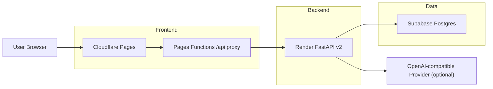

# POTATO-TODO 架构与维护手册

本文档用于说明当前项目的前端、后端、数据库与部署拓扑，并作为后续维护、迭代、排障与交接的长期参考文档。

适用范围：

- 当前 v2 工程化重构版本
- 当前低成本公网部署方案
- 当前仓库主线结构 `Cloudflare Pages + Render + Supabase`

## 1. 当前线上架构总览



一句话概括：

- 浏览器访问 `Cloudflare Pages`
- 前端所有 `/api/*` 请求先进入 `Pages Functions`
- `Pages Functions` 再转发到 `Render` 上的 FastAPI v2
- FastAPI v2 连接 `Supabase Postgres`

## 2. 仓库结构与职责

```text
.
├── apps/
│   ├── web/                  # v2 前端主应用
│   └── api/                  # v2 后端主应用
├── app/                      # 旧版共享模型与兼容层，v2 仍复用其 DB/Base/Models
├── packages/
│   └── contracts/            # 前后端共享 DTO / 类型契约
├── functions/                # Cloudflare Pages Functions
├── docs/                     # 部署、架构、维护文档
├── render.yaml               # Render 后端部署配置
└── agent_v2.md               # 工程化实施主档案
```

维护时要特别记住：

- `apps/web` 是前端主线
- `apps/api` 是后端主线
- `app/` 不是“废弃目录”，当前数据库连接、ORM Base、数据模型仍从这里复用
- `functions/` 是 Cloudflare Pages 的线上代理层，不可随意删除

## 3. 前端架构

### 3.1 技术栈

- React 18
- TypeScript
- Vite
- TanStack Router
- TanStack Query
- React Hook Form
- Zod
- Tailwind CSS v4
- Radix UI primitives
- visx

### 3.2 前端目录职责

`apps/web/src` 的主要结构如下：

- `app/`
  - 应用级 provider 和 router 装配
- `routes/`
  - 页面级路由
  - 当前主页面包括 `workspace / focus / planner / analytics / rooms / settings / auth`
- `features/`
  - 按业务域拆分 API 和状态协作
  - 例如 `auth / focus / planner / rooms / settings / workspace`
- `shared/components/`
  - 共享 UI、布局、滚动特效、ticker、对话框等
- `shared/lib/`
  - API 请求层、错误模型、日期工具、类名工具
- `index.css`
  - 当前设计系统、RePay 风格视觉语言、路由级样式基座

### 3.3 前端请求模型

前端当前不是直接写死 Render API 域名，而是统一使用相对路径：

```text
/api/v2/*
```

这样做的原因是：

- 浏览器层面只感知当前前端域名
- Cloudflare Pages Functions 负责把 `/api/*` 转发到真实 Render API
- 登录、刷新 token、SSE 房间流都能在这一层保持统一路径模型

对应关键文件：

- [apps/web/src/shared/lib/api.ts](/Users/lin20051105/Desktop/potato_todo/apps/web/src/shared/lib/api.ts)
- [apps/web/src/features/auth/api.ts](/Users/lin20051105/Desktop/potato_todo/apps/web/src/features/auth/api.ts)
- [functions/api/[[path]].ts](/Users/lin20051105/Desktop/potato_todo/functions/api/[[path]].ts)

### 3.4 前端维护规则

后续维护前端时，优先遵守这些规则：

1. 视觉改动尽量收敛到 `index.css` 与共享组件，不要把样式逻辑散落到每个页面。
2. 新增页面时，先补路由，再补 feature API，再补页面 UI，不要在页面里直接写裸 `fetch`。
3. 新增接口时，优先进入 `features/*/api.ts`，不要绕开共享请求层。
4. 如果未来要从相对路径 `/api/*` 切换到显式 `API_BASE_URL`，必须同步调整：
   - `shared/lib/api.ts`
   - `features/auth/api.ts`
   - `rooms-page.tsx` 中的 `EventSource`
   - Cloudflare `functions/` 代理文档
5. 不要在认证后页面重新引入高频 canvas、无限轮询或长时间高开销动画。

## 4. 后端架构

### 4.1 技术栈

- FastAPI
- SQLAlchemy
- Pydantic v2
- PyJWT
- Alembic
- SSE

### 4.2 后端入口

当前 v2 后端入口：

- [apps/api/potato_api/app.py](/Users/lin20051105/Desktop/potato_todo/apps/api/potato_api/app.py)

线上启动命令：

```bash
uvicorn apps.api.potato_api.app:app --host 0.0.0.0 --port $PORT
```

健康检查：

```text
/api/v2/health
```

### 4.3 模块化单体结构

`apps/api/potato_api/modules` 当前包含：

- `auth`
- `subjects`
- `tasks`
- `calendar`
- `timer`
- `analytics`
- `assistant`
- `rooms`
- `settings`
- `backup`

每个模块的职责边界：

- `router.py`
  - 入参、鉴权、响应装配
- `service.py`
  - 业务编排
- `repository.py`
  - 数据访问
- `domain.py`
  - 规则、状态语义、数据整形
- `schemas.py`
  - 模块请求/响应模型

### 4.4 当前后端的一个关键现实

虽然 v2 API 已经迁移到了 `apps/api`，但当前数据库底座仍然复用根目录 `app/` 下的共享层：

- [app/database.py](/Users/lin20051105/Desktop/potato_todo/app/database.py)
- [app/models.py](/Users/lin20051105/Desktop/potato_todo/app/models.py)
- [apps/api/potato_api/legacy_bridge.py](/Users/lin20051105/Desktop/potato_todo/apps/api/potato_api/legacy_bridge.py)

这意味着：

- 当前 v2 不是“完全脱离旧 app 的全新独立 ORM”
- `apps/api/potato_api/core/db.py` 实际上是对 `app.database` 的桥接
- 改数据库表结构时，不能只改 `apps/api`，还必须同步考虑 `app/models.py`

### 4.5 后端维护规则

1. 新增 API 功能时，优先在 `apps/api/potato_api/modules` 内按模块扩展。
2. 不要把新业务继续塞回 `app/main.py` 或旧模板路由。
3. 涉及用户资源的接口，必须做 ownership guard。
4. 认证相关变更要同步检查：
   - `core/security.py`
   - `modules/auth/*`
   - `core/config.py`
   - Cloudflare 前端登录链路
5. 涉及房间实时流时，要同步检查：
   - `modules/rooms/*`
   - `core/room_hub.py`
   - 前端 `rooms-page.tsx`
6. 如果接口契约变化，必须同步更新：
   - `packages/contracts/src/index.ts`
   - 前端对应 `features/*/api.ts`
   - `agent_v2.md`

## 5. 数据库架构

### 5.1 当前数据库方案

- 本地开发默认：SQLite
- 公网部署：Supabase PostgreSQL

环境变量：

```text
STUDY_DB_URL
```

### 5.2 ORM 与表模型来源

当前 ORM 元数据与核心表定义位于：

- [app/database.py](/Users/lin20051105/Desktop/potato_todo/app/database.py)
- [app/models.py](/Users/lin20051105/Desktop/potato_todo/app/models.py)

主要表包括：

- `users`
- `subjects`
- `tasks`
- `schedule_events`
- `study_sessions`
- `timer_states`
- `ai_drafts`
- `ai_conversations`
- `ai_messages`
- `user_settings`
- `study_rooms`
- `study_room_members`
- `settings`

### 5.3 初始化与兼容迁移机制

当前启动时会执行：

- `Base.metadata.create_all`
- `_run_compatibility_migrations()`

这说明当前存在“轻量兼容迁移”逻辑，而不是所有结构变化都只依赖 Alembic。

维护时必须理解：

- 小范围兼容字段补齐，当前可能由 `app/database.py` 内部逻辑处理
- 正式结构演进，仍建议写 Alembic migration
- 不要只改模型不改迁移策略

### 5.4 数据库维护规则

1. 修改表结构时，至少检查：
   - `app/models.py`
   - `app/database.py`
   - `migrations/`
   - 使用该表的 `apps/api/potato_api/modules/*`
2. 生产环境改字段前，先备份 Supabase 数据。
3. 新增索引、唯一约束、外键时，要评估旧数据是否已经满足约束。
4. 对于用户隔离相关字段，不能破坏现有 `user_id` 语义。

## 6. 当前部署架构

### 6.1 前端部署

- 平台：Cloudflare Pages
- 产物目录：`apps/web/dist`
- 代理层：`functions/api/[[path]].ts`

关键环境变量：

```text
NODE_VERSION=22
PNPM_VERSION=10.12.1
API_ORIGIN=https://你的-render-service.onrender.com
```

### 6.2 后端部署

- 平台：Render Web Service
- 部署入口：仓库根目录
- 构建命令：

```bash
pip install -r apps/api/requirements.txt
```

- 启动命令：

```bash
uvicorn apps.api.potato_api.app:app --host 0.0.0.0 --port $PORT
```

关键环境变量：

```text
APP_ENV=production
STUDY_DB_URL=...
SESSION_SECRET=...
JWT_SECRET=...
COOKIE_SECURE=true
CORS_ORIGINS=https://potato-todo.pages.dev
```

### 6.3 数据库部署

- 平台：Supabase Postgres
- 建议连接方式：Pooler
- SQLAlchemy 连接前缀建议：

```text
postgresql+psycopg://...
```

## 7. 发布与维护的推荐流程

### 7.1 前端样式或交互改动

适用场景：

- 页面视觉更新
- 布局调整
- 动效优化
- 组件行为微调

推荐流程：

1. 本地验证 `pnpm --filter @potato/web build`
2. 提交代码
3. 推送到 `main`
4. 观察 Cloudflare Pages 生产部署
5. 线上验证关键页面

这类改动通常不需要重启 Render。

### 7.2 后端逻辑改动

适用场景：

- API 行为修改
- 鉴权逻辑修改
- 业务规则变化

推荐流程：

1. 本地跑 API 测试
2. 提交代码
3. 推送到 `main`
4. 观察 Render 部署日志
5. 打开 `/api/v2/health`
6. 再验证前端主链路

### 7.3 接口契约改动

适用场景：

- 请求字段变动
- 响应结构变动
- 枚举值变动

必须按下面顺序改：

1. `packages/contracts`
2. `apps/api`
3. `apps/web`
4. `docs/`
5. `agent_v2.md`

不要只改前端或只改后端。

### 7.4 数据库结构改动

适用场景：

- 增字段
- 改字段类型
- 增表
- 加约束

推荐流程：

1. 先备份 Supabase
2. 设计 migration
3. 修改 `app/models.py`
4. 修改对应 API 模块
5. 先在本地数据库验证
6. 再上生产

## 8. 日常维护重点

### 8.1 最常维护的配置项

Cloudflare Pages：

- `API_ORIGIN`
- 当前生产分支
- 构建日志
- 自定义域名

Render：

- `CORS_ORIGINS`
- `JWT_SECRET`
- `SESSION_SECRET`
- `COOKIE_SECURE`
- `STUDY_DB_URL`
- 部署日志

Supabase：

- 连接串
- 表结构
- 数据备份
- 连接数与额度

### 8.2 最容易踩坑的地方

1. Cloudflare `/api` 代理没部署上，结果前端 `/api/*` 返回 HTML 而不是 JSON。
2. `API_ORIGIN` 错填成带 `/api` 的地址。
3. Render 的 `CORS_ORIGINS` 没包含前端域名。
4. 只改了 `apps/api`，忘了当前数据库模型还在 `app/models.py`。
5. 把 Cloudflare Pages Root Directory 错设为 `apps/web`，导致根目录 `functions/` 和 `packages/` 不可见。

## 9. 排障手册

### 9.1 前端能打开，但登录/注册失败

先检查：

1. `https://你的-pages域名/api/v2/health` 是否返回 JSON
2. Cloudflare 是否已部署 `functions/api/[[path]].ts`
3. `API_ORIGIN` 是否正确
4. Render 的 `CORS_ORIGINS` 是否包含前端域名

### 9.2 前端样式正常，但数据全空

优先检查：

1. `/api/v2/health`
2. Render 部署日志
3. Supabase 连接串
4. 浏览器请求是否命中了 `/api/*`

### 9.3 Render 启动失败

优先检查：

1. `STUDY_DB_URL`
2. `JWT_SECRET`
3. `SESSION_SECRET`
4. 启动命令是否仍是：

```bash
uvicorn apps.api.potato_api.app:app --host 0.0.0.0 --port $PORT
```

### 9.4 数据库升级后出错

优先检查：

1. `app/models.py` 是否同步
2. migration 是否同步
3. 旧数据是否违反新约束
4. 兼容迁移逻辑是否受影响

## 10. 备份与回滚

### 10.1 数据备份

建议至少保留两条备份路径：

1. Supabase 平台级数据库备份
2. 应用级导出能力：
   - `GET /api/v2/backup/export`

重大数据库调整前，先做备份。

### 10.2 前端回滚

前端回滚优先使用：

- Cloudflare Pages 上一个成功生产部署

### 10.3 后端回滚

后端回滚优先使用：

- Render 上一个成功部署版本
- 或回退 Git 提交重新部署

## 11. 后续维护建议

这是最重要的部分。

### 11.1 维护时要始终把项目分成 4 层看

1. `apps/web`
2. `functions/`
3. `apps/api`
4. `app/models + database + Supabase`

不要把它误以为是“只有前端和后端两层”。

### 11.2 任何跨层改动都要同步更新文档

至少同步以下内容：

- `README.md`
- `agent_v2.md`
- 对应 `docs/*.md`

### 11.3 当前最值得继续工程化收敛的点

后续如果继续重构，优先顺序建议是：

1. 把数据库模型逐步从根目录 `app/` 完整迁移到 `apps/api`
2. 把 migration 规范进一步统一
3. 视需要决定是否把前端从相对 `/api` 路径升级成显式 `API_BASE_URL`
4. 在 Render / Cloudflare 上补更多环境分层，例如 preview / production

### 11.4 什么不要乱动

以下部分在没有完整验证前不要随意调整：

- `functions/api/[[path]].ts`
- Render 启动命令
- `STUDY_DB_URL`
- JWT / refresh cookie 相关配置
- `app/models.py` 中已有表的主键、外键、唯一约束

## 12. 关联文档

- [docs/render-redeploy-v2.md](/Users/lin20051105/Desktop/potato_todo/docs/render-redeploy-v2.md)
- [docs/cloudflare-pages-deploy.md](/Users/lin20051105/Desktop/potato_todo/docs/cloudflare-pages-deploy.md)
- [agent_v2.md](/Users/lin20051105/Desktop/potato_todo/agent_v2.md)
